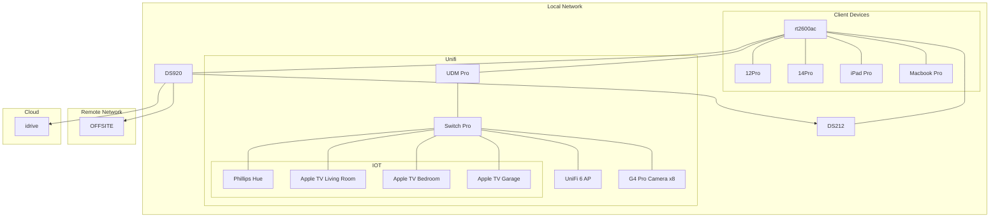
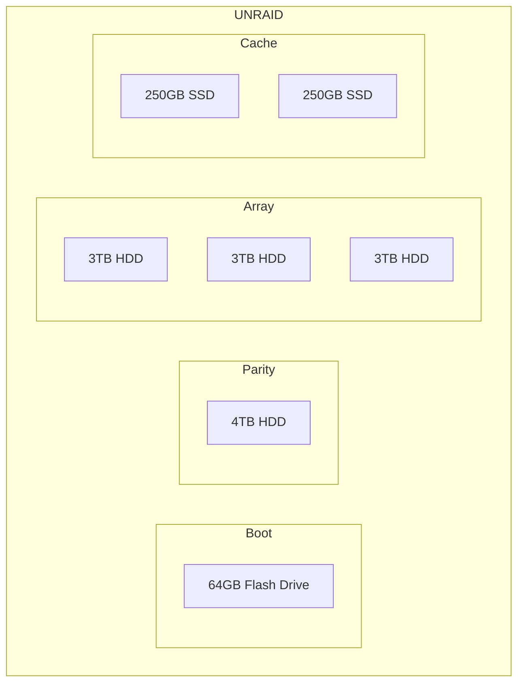
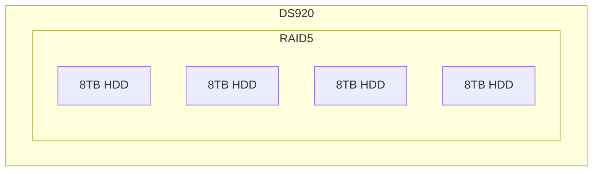
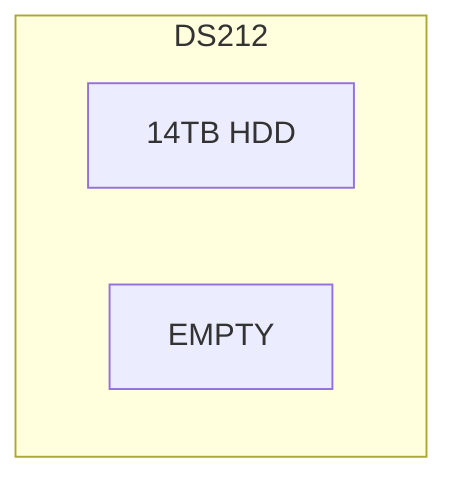

## Password Management
An important aspect of setting up this home network is maintaining the credentials to dozens of systems that will often go untouched for months - if not years - at a time. 

### iCloud Keychain

Due to us living in an Apple ecosystem, iCloud keychain is the ideal method for storage/retrieval for any accounts accessed via web UI. iCloud Keychain can generate complex passwords that are neatly separated by dashes for easier typing when not using an Apple device that autofills the password. 

iCloud Keychain can be accessed in `System Preferences (MacOS)/Settings (iOS) > Passwords`. 

### Bitwarden

The one glaring flaw with iCloud Keychain is that it requires a web URL to save a password. Due to this limitation, Bitwarden is used for tracking credentials on non-web accounts.

Bitwarden is locally encrypted and cloud synced and secured with 2-factor authentication. The app is available on the [App Store](https://apps.apple.com/us/app/bitwarden/id1352778147?mt=12). 

Bitwarden is also used for storing secure notes related to the network configuration and specific entries will be referenced throughout this document rather than publically documenting that information.

## Synology 


### Web Account

- Set up or reset primary Synology.com account with Safari generated password. Copy password to Bitwarden. 
- Enable 2-Factor Authentication 
- Download [Synology Secure Sign In app](https://apps.apple.com/pl/app/synology-secure-signin/id1513105891)
- Configure DDNS for personal URL. Details are stored in [Bitwarden](https://vault.bitwarden.com/#/vault?type=2&itemId=b878546a-6e4f-42b1-8e9a-af29018a7052).


### RT2600ac

`192.168.1.1` ([Web UI](http://192.168.1.1:8000/webman/index.cgi))
- Create router admin account with Safari generated password. Store in [Bitwarden](https://vault.bitwarden.com/#/vault?itemId=542ba735-2c18-4c3a-be30-af290178f21a). 
- Disabled UPNP
- Enable Firewall and set all to Deny 


<div class="row">
    <div class="col-sm mt-3 mt-md-0">
        
    </div>
</div>

- Add Port forwarding for DS920 OpenVPN 1194, DS920 DSM (HTTPS) 5001
- Identify stray WiFi clients and block them from DCHP list. 
- **TODO:** [Research if VLANs](https://www.reddit.com/r/HomeNetworking/comments/byw9mt/comment/eqndvi6/?utm_source=share&utm_medium=web2x&context=3) are appropriate for my use case. 

#### DHCP Reservations

| Category | IP | Hostname | Notes | 
| --- | --- | --- | --- | 
| Router | 192.168.1.1 | rt2600ac | | 
| NAS | 192.168.1.20 | DS920 | | 
| NAS | 192.168.1.25 | DS212 | | 
| Homekit | 192.168.1.30 | Hue Hub | | 
| Homekit | 192.168.1.31 | Harmony Hub | | 
| Homekit | 192.168.1.32 | Blue Iris | | 
| iOS & Mac | 192.168.1.40 | iPhone 1 | | 
| iOS & Mac | 192.168.1.41 | iPhone 2 | | 
| iOS & Mac | 192.168.1.42 | iPad | | 


| iOS & Mac | 192.168.1.43 | Mac Mini | | 
| iOS & Mac | 192.168.1.44 | Macbook Air | | 
| iOS & Mac | 192.168.1.45 | Macbook Pro | | 
| Media | 192.168.1.50 | Playstation 4 | | 
| Media | 192.168.1.51 | Nintendo Switch | | 
| Media | 192.168.1.52 | Apple TV 4k | | 
| Media | 192.168.1.53 | Apple TV Garage | | 
| Media | 192.168.1.54 | Apple TV Bedroom | | 

### DS920

|Setting|Value|
| ----------- | ----------- |
| IP Address | [192.168.1.20](http://192.168.1.20:5000/#/signin)| 
| Device Name | `DS920`       |
| Volume Name   | `Volume1`        |
| Capacity | `20TB`|

- Configure admin account with Safari generated password and store in Bitwarden. 
- Disable the default admin account. 
- Configure file shares: 
    - Photos
    - Videos
    - Audio 
    - Documents 
    - Projects 
- Download Plex Server Synology package
- Configure APC UPS: `DS920 > Control Panel > Hardware & Power > UPS`


### DS212

|Setting|Value|
| ----------- | ----------- |
| IP Address | [192.168.1.25](http://192.168.1.25:5000/#/signin)| 
| Device Name | `DS212`       |
| Volume Name   | `Volume1`        |
| Capacity | `2.7TB`|

- Configure Hyperdrive backup between DS920 and DS212 for Media Offload Archive.

## UniFi

### UDM Pro 


### Switch Pro 24 PoE


## IDrive

- Download Synology iDrive package
- [Credentials](https://vault.bitwarden.com/#/vault?folderId=a9a383ba-2f2d-46e1-a63a-af2a001ce6a5&itemId=d2b05005-e2e0-4163-8ee5-af2a001d3db4)


## Tailscale 

Tailscale in the [Mac App Store](https://apps.apple.com/us/app/tailscale/id1475387142?mt=12)

Tailscale in the Synology Package Center

On Synology, follow [these steps](https://tailscale.com/kb/1131/synology/#persist-the-tun-settings) to keep Tailscale operational after a reboot. 

## OFFSITE server config




## OpenVPN

- [Instruction video](https://www.youtube.com/watch?v=qbfa-YVUfls)
- Download Synlogy VPN Server package
- From the VPN Server package, enable OpenVPN Server 
- Set privileges for DS920 admin account to allow OpenVPN access.
- Configure port forwardig on RT2600ac for UDP port 1194 to 192.168.1.20
- Configure [Synology DDNS](https://kb.synology.com/en-us/DSM/help/DSM/AdminCenter/connection_ddns?version=6)
- Export config files and edit to create Full and Split configs
- Install Passepartout on client devices and load config. 
- Enable firewall only for Local and VPN traffic. 
- **TODO:** [Link aggregation from Synology to Switch 24PoE](https://kb.synology.com/en-my/DSM/help/DSM/AdminCenter/connection_network_linkaggr?version=6)
- 


## iCloud 

Every project has a beautiful feature showcase page.
It's easy to include images in a flexible 3-column grid format.
Make your photos 1/3, 2/3, or full width.

To give your project a background in the portfolio page, just add the img tag to the front matter like so:

    ---
    layout: page
    title: project
    description: a project with a background image
    img: /assets/img/12.jpg
    ---

<div class="row">
    <div class="col-sm mt-3 mt-md-0">
        
    </div>
    <div class="col-sm mt-3 mt-md-0">
        
    </div>
    <div class="col-sm mt-3 mt-md-0">
        
    </div>
</div>
<div class="caption">
    Caption photos easily. On the left, a road goes through a tunnel. Middle, leaves artistically fall in a hipster photoshoot. Right, in another hipster photoshoot, a lumberjack grasps a handful of pine needles.
</div>
<div class="row">
    <div class="col-sm mt-3 mt-md-0">
        
    </div>
</div>
<div class="caption">
    This image can also have a caption. It's like magic.
</div>

You can also put regular text between your rows of images.
Say you wanted to write a little bit about your project before you posted the rest of the images.
You describe how you toiled, sweated, *bled* for your project, and then... you reveal its glory in the next row of images.


<div class="row justify-content-sm-center">
    <div class="col-sm-8 mt-3 mt-md-0">
        
    </div>
    <div class="col-sm-4 mt-3 mt-md-0">
        
    </div>
</div>
<div class="caption">
    You can also have artistically styled 2/3 + 1/3 images, like these.
</div>


The code is simple.
Just wrap your images with `<div class="col-sm">` and place them inside `<div class="row">` (read more about the <a href="https://getbootstrap.com/docs/4.4/layout/grid/">Bootstrap Grid</a> system).
To make images responsive, add `img-fluid` class to each; for rounded corners and shadows use `rounded` and `z-depth-1` classes.
Here's the code for the last row of images above:


```html
<div class="row justify-content-sm-center">
    <div class="col-sm-8 mt-3 mt-md-0">
        
    </div>
    <div class="col-sm-4 mt-3 mt-md-0">
        
    </div>
</div>
```

