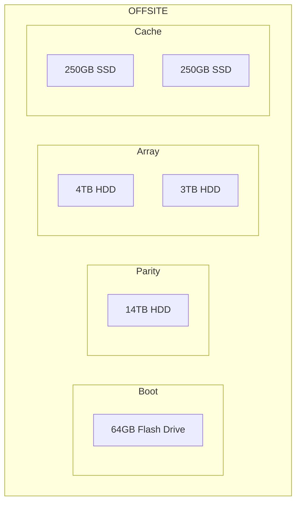

## Boot Drive
- For this build I'm using a 64GB USB Type-A flash drive as the OS boot drive. 
- Download unRAID drive maker
- Format and create boot drive
- Alter BIOS/UEFI to boot from the USB drive

## Storage Pool 

## Apps
### Tailscale
### Plex

